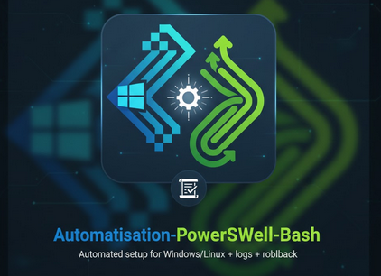

# Automatisation-PowerShell-Bash-
script d’installation automatisée d’un environnement Windows ou Linux + logs + rollback.

<p align="center">
  
</p>


## 🎯 Objectif du projet
Ce projet a pour but de simplifier et fiabiliser le déploiement d’un environnement Windows ou Linux grâce à une automatisation complète.  
Il permet d’éviter les erreurs humaines, d’accélérer les installations et d’assurer une traçabilité totale via un système de logs détaillés.

---

## 🧩 Fonctionnalités principales
- Installation automatisée de composants Windows (services, rôles, logiciels…)
- Vérification préalable de l’environnement (pré-requis, droits, connectivité)
- Génération de logs complets (succès, erreurs, temps d’exécution)
- Mécanisme de **rollback** en cas d’échec
- Messages d’état clairs pour faciliter le support
- Scripts compatibles PowerShell et Bash selon les besoins

---

## 🏗️ Architecture du projet

---

## 🚀 Installation & utilisation

### 1. Cloner le dépôt
Set-ExecutionPolicy Bypass -Scope Process -Force
.\src\install.ps1
bash src/install.sh

```bash
git clone https://github.com/webmasterdu63-creator/Automatisation-PowerShell-Bash.git
